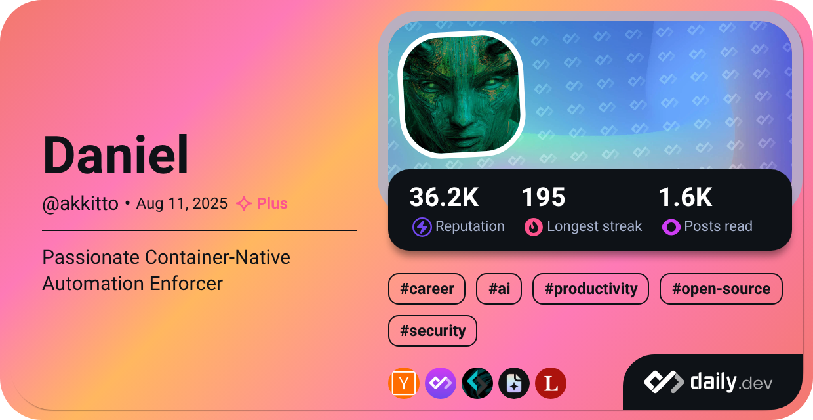

  <h1>Greetings!</h1>

  

 

  <h2>🚀 About Me</h2>

I'm passionate about Infrastructure as Code, Kubernetes, Docker, and all things DevOps. In my free time, you'll find me exploring new technologies and contributing to open-source projects.

Writing backends for optimising internal workflows and automating repetitive processes is what I'm doing, besides diving into DevOps-specific projects.

I'm always open to meeting new people and discussing a wide range of topics.

  <h2>🛠️ My Tech Stack</h2>

  
<strong>Languages</strong>

   
  
   
   
  
   
   
   
  

  
<strong>Dev Components</strong>

   
  
  
   
  
   
  <!-- Apache Kafka -->
  

  
<strong>Dev Tools</strong>

   
  <!-- Helix Editor -->
  
   
   
  <!-- Coder -->
  
  
  
  

  
<strong>DevOps Tools</strong>

   
   
  
  
  
  <!-- Fly.io -->
  
   
  <!-- Hyper-V -->
  
  <!-- Windows Subsystem for Linux -->
  
   
  
   
  <!-- OpenEBS -->
  
   
   
   
  
  <!-- OpenTofu -->
  
  
  
  
  
  
   
   
  
  
  
   
   
  

  
<strong>Shared Tools</strong>

   
  
  
  
  
  
  
  
  
  
  
  
  <!-- Alpine Linux -->
  
  
  
  <!-- OpenZFS -->
  
  <!-- ChatGPT (OpenAI) -->
  
  <!-- Perplexity AI -->
  
  <!-- Gemini (Google) -->
  
  <!-- Suno AI -->
  
  <!-- Midjourney -->
  
  <!-- Sora (OpenAI) -->
  
  <!-- Tabby Terminal (using iTerm2 logo) -->
  
  <!-- BorgBackup -->
  
  <!-- AnyDesk -->
  
  <!-- RustDesk -->
  
  <!-- OpenVPN -->
  
  
  
  <!-- NOSTR -->
  

  
<strong>Organisation Tools</strong>

  
  <!-- GitLab Kanban -->
  
  
  
  
  
  
  
  
  
  <!-- TeamSpeak -->
  
  <!-- Mumble -->
  
  <!-- Wiki.js -->
  
  <!-- AFFiNE -->
  
  <!-- Anytype -->
  
  

  

    <h2>🌍 Standards</h2>
  

  

  <!-- YAML -->
  
  <!-- TOML -->
  
  <!-- JSON -->
  
  <!-- NUON -->
  
  <!-- Conventional Commits -->
  
  <!-- OpenAPI -->
  
  <!-- GraphQL -->
  
  <!-- JSON Schema -->
  
  <!-- OpenMetrics -->
  
  <!-- OpenTelemetry -->
  
  

  

    <h2>🧬 Concepts</h2>
  

  

    
    <!-- Simplicity -->
    
     
    
    
     
     
     
     
     
    
    
    
    
    <!-- Microservice Architecture -->
    
    <!-- DevOps Mindset -->
    
    <!-- DevSecOps -->
    
    <!-- AIOps -->
    
    <!-- MLOps -->
    
    <!-- Platform Engineering -->
    
    <!-- Developer Experience -->
    
  

  <h2>🌱 Currently Learning</h2>

  
  
  
  
  
  <!-- LLM Development -->
  

  <h2>🏆 Certifications</h2>

  
  <!-- Datadog Certified: Datadog Fundamentals -->
  

  <h2>🎮 Fun</h2>

<!-- PC Master Race -->

<!-- Steam -->

<!-- GOG -->

<!-- Steam Deck -->

<!-- PlayStation Portable -->

<!-- PlayStation Vita -->

<!-- Android Root -->

<!-- Calligraphy -->

<!-- Origami -->

<!-- Blockchain -->

<!-- Bicycling -->

<!-- TV Series -->

  <h2>📊 GitHub Stats</h2>

  
  

  <h2>🔥 Streak Stats</h2>

  

<!-- 

  <h2>🎨 Fun Fact</h2>

Did you know? I also dabble in digital art and love creating tech-inspired illustrations! Check out some of my work [here](https://yourartportfolio.com). -->

  <h2>📫 Let's Connect</h2>

Feel free to reach out, if you want to discuss tech, collaboration, or anything else.

 

  
  
  

